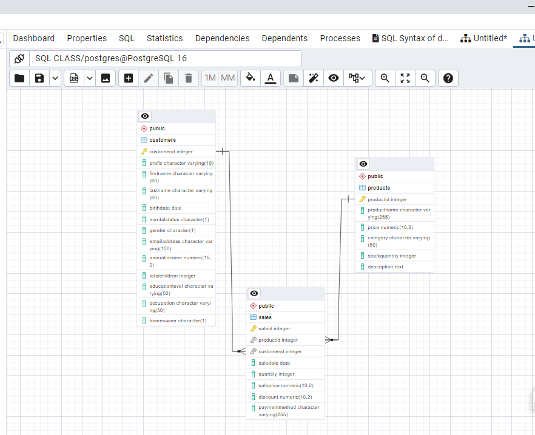
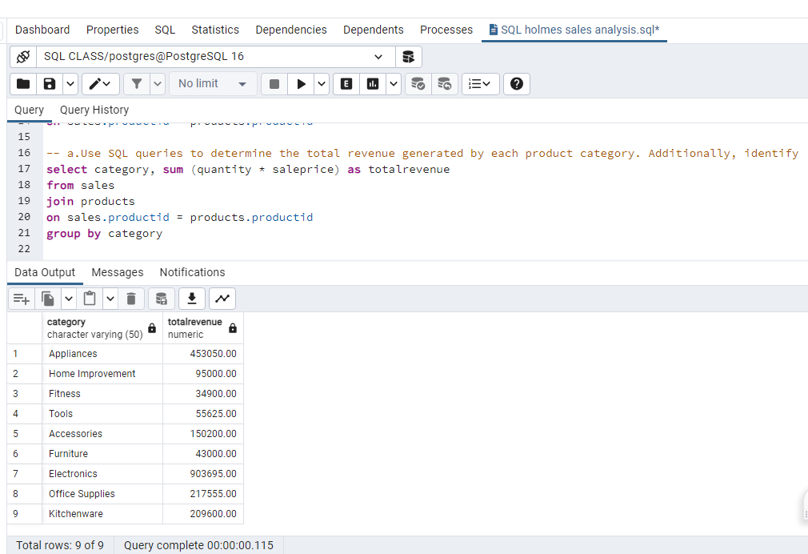
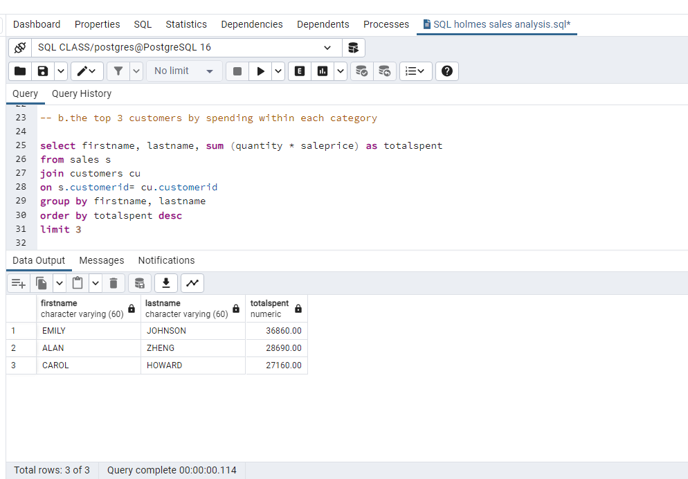

# Holmes-Sales-analysis using SQL

## Introduction

This is a SQL project on sales analysis of an imaginary store called ** Holmes Sales Analysis**. 
The project is to analyze and derive Insights to answer crucial questions and help the store make data decisions.

_**Disclaimer**_: _All datasets and reports do not represent any company, institution or country, but just a dummy dataset to demonstrate capabilities of SQL._

## Problem Statement:
1.	Identify the patterns and trends in sales transactions among the product categories
2.	Optimize sales performance and revenue generated by each product
3.	Develop a stored procedure for updating stock levels by product category.

## Project Objective
The goal is to identify trends & patterns that could drive strategic business decisions and improve overall sales performance.

## Skills/ concepts demonstrated:
- SQL Syntax and Queries ( select , Joins, Subqueries, Aggregate functions)
- Data Manipulation ( Insert, Update and Delete statement)
- Advanced SQL Techniques ( Stored procedures and Functions, Views )
- Database design (ER diagram)

Solution 1a     |  Solution 1b
:-------------:|:--------------:
 | 
  
